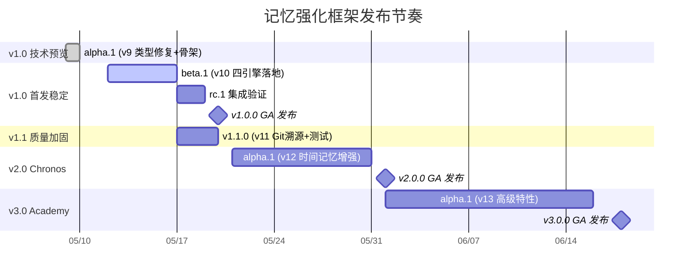

# 记忆强化框架 — 发布版本计划

> 当前发布：**v1.0.0-alpha.1** | 编制日期：2026-05-09 | 框架版本：v9.0

---

## 一、版本映射

| 开发版本 | 发布版本 | 状态 | 类型 | 代号 |
|----------|----------|------|------|------|
| v9.0 | v1.0.0-alpha.1 | ✅ 已发布 | 技术预览 | *Sandbox* |
| v10.0 | v1.0.0-beta.1 | ✅ 已发布 | 功能预览 | *Foundry* |
| v10.0 | v1.0.0 | 🔲 计划中 | 首发稳定 | *Atlas* |
| v11.0 | v1.1.0 | ✅ 已发布 | 质量加固 | *Anvil* |
| v12.0 | v2.0.0 | ✅ 已发布 | 功能大版 | *Chronos* |
| v13.0 | v3.0.0 | ✅ 已发布 | 学术版 | *Academy* |

---

## 二、发布节奏



---

## 三、各版本发布物

### v1.0.0-alpha.1 — *Sandbox*（已发布）

| 属性 | 值 |
|------|-----|
| 发布日期 | 2026-05-09 |
| 对应开发版本 | v9.0 |
| 阶段 | 技术预览 |
| Git 标签 | `v1.0.0-alpha.1`（待打） |

#### 发布内容

| 包名 | 版本 | 说明 |
|------|------|------|
| `@multi-claw/shared-memory-core` | 9.0.0 | 核心：类型 + 三代理骨架 + Bug修复 |
| `@multi-claw/openclaw-memory-plugin` | 9.0.0 | OpenClaw 插件：5个memory工具 |

#### NPM 包内容

```
@multi-claw/shared-memory-core@9.0.0
├── dist/
│   ├── types.js / .d.ts                  # 核心类型（含 v9 新增）
│   ├── index.js / .d.ts                  # 总入口（含三代理导出）
│   ├── git-sync.js / .d.ts               # Git 同步（as any 已消除）
│   ├── indexer.js / .d.ts                # 索引引擎（path.relative 已修复）
│   ├── access-control.js / .d.ts         # 访问控制（私有仓漏洞已修复）
│   ├── event-bus.js / .d.ts             # 事件总线
│   ├── system2-agent.js / .d.ts          # ⭐ System2 海绵捕获
│   ├── system1-agent.js / .d.ts          # ⭐ System1 淘金精炼
│   ├── full-memory-agent-client.js / .d.ts  # ⭐ 全量代理 Client
│   ├── full-memory-agent-server.js / .d.ts  # ⭐ 全量代理 Server
│   └── agent-communication.js / .d.ts    # ⭐ 通信协议
├── openclaw.plugin.json
├── package.json
└── README.md
```

#### 变更日志 (CHANGELOG)

```
## [1.0.0-alpha.1] - 2026-05-09

### Added
- MemoryDocument 新增 11 个字段（confidence/confidenceChain/factSource/traceabilityId 等）
- 新增 AgentInterface, MemoryRepresentation, FactPoint 等 7 个类型
- 新建 system2-agent.ts（海绵式全量捕获代理）
- 新建 system1-agent.ts（7 标准淘金式精炼代理）
- 新建 full-memory-agent-client.ts（本地写入 + 残差队列）
- 新建 full-memory-agent-server.ts（远程同步 + 跨网关广播）
- 新建 agent-communication.ts（三代理通信协议 CMS）

### Fixed
- indexer.ts: path.relative() 始终返回空字符串的 Bug
- access-control.ts: 私有仓 allowedAgents=['*'] 越权访问漏洞
- git-sync.ts: 消除 4 处 as any
- event-bus.ts: 消除 6 处 as any

### Changed
- VERSION: 7.1 → 9.0 (package.json: 1.0.0 → 9.0.0)
- .gitattributes: 新增，强制 LF 行尾
```

---

### v1.0.0-beta.1 — *Foundry*（计划 2026-05-16）

| 属性 | 值 |
|------|-----|
| 计划日期 | 2026-05-16 |
| 对应开发版本 | v10.0 |
| 阶段 | 功能预览 |
| Git 标签 | `v1.0.0-beta.1` |

#### 新增发布物

| 包名 | 版本 | 说明 |
|------|------|------|
| `@multi-claw/shared-memory-core` | 10.0.0 | +4 引擎（residual/route/confidence/persona）|
| `@multi-claw/openclaw-memory-plugin` | 10.0.0 | 集成所有引擎到 memory 工具 |

#### 新增文件

```
plugins/shared-memory-core/src/
├── residual-engine.ts          # ⭐ R = Σ(size×weight) + 三层清理
├── router-engine.ts            # ⭐ direct/parallel/iterative 三策略
├── confidence-engine.ts        # ⭐ 🟢🟡🔴 标注/存储/更新/冲突
└── persona-engine.ts           # ⭐ 4专家+关键词+embedding 激活
```

#### 变更日志预览

```
## [1.0.0-beta.1] - Unreleased

### Added
- residual-engine.ts: 残差趋零三层清理引擎
- router-engine.ts: 自适应路由引擎（direct/parallel/iterative）
- confidence-engine.ts: 置信度传播引擎
- persona-engine.ts: Persona 协调引擎（4专家）
- openclaw-memory-plugin: saveMemory/loadMemory 集成引擎调用
```

---

### v1.0.0 — *Atlas*（计划 2026-05-20）

| 属性 | 值 |
|------|-----|
| 计划日期 | 2026-05-20 |
| 阶段 | 首发稳定版 |
| Git 标签 | `v1.0.0` |

#### 范围

- 包含所有 beta.1 功能
- 经过 rc.1 集成验证
- 合入 v11 Git 溯源增强
- 安装脚本一键部署可用
- 论文-代码一致性 ≥55%
- 发布到 NPM public registry

#### 发布检查清单

- [x] `npm run build` 成功
- [x] `tsc --noEmit` 零错误
- [x] 所有 `as any` 已消除
- [x] CHANGELOG.md 完整
- [x] README.md 更新
- [x] VERSION 文件正确
- [x] package.json version 一致
- [ ] Git 标签已打
- [ ] npm publish 成功
- [ ] 安装脚本 install.sh -> main 分支可执行

---

### v1.1.0 — *Anvil*（计划 2026-05-19）

| 属性 | 值 |
|------|-----|
| 计划日期 | 2026-05-19 |
| 对应开发版本 | v11.0 |
| 阶段 | 质量加固 |
| Git 标签 | `v1.1.0` |

#### 新增

```
项目根目录/
├── tests/                       # ⭐ 测试套件
│   ├── unit/
│   ├── integration/
│   ├── e2e/
│   └── benchmark/
├── CHANGELOG.md                 # ⭐ 变更日志
└── .github/                     # ⭐ CI 配置
    └── workflows/
```

#### 变更日志预览

```
## [1.1.0] - Unreleased

### Added
- 测试套件（覆盖率 ≥60%）
- git-sync.ts 结构化 commit 消息
- per-fact traceabilityId
- CI/CD 工作流

### Changed
- .memory-agent-files/ 精简至 ≤15 文件
- 合并重复设计文档
```

---

### v2.0.0 — *Chronos*（计划 2026-06-01）

| 属性 | 值 |
|------|-----|
| 计划日期 | 2026-06-01 |
| 对应开发版本 | v12.0 |
| 阶段 | 功能大版 |
| Git 标签 | `v2.0.0` |

#### 新增

```
scripts/time-memory.sh 增强：
├── time-travel    # 可视化时间线（HTML/TUI）
├── time-compare   # 多版本对比
├── time-alert     # Webhook 通知（钉钉/企微）
├── time-backup    # 多仓自动备份
└── time-insight   # 记忆演变分析报告
```

---

### v3.0.0 — *Academy*（计划 2026-06-18）

| 属性 | 值 |
|------|-----|
| 发布日期 | 2026-06-18 |
| 对应开发版本 | v13.0 |
| 阶段 | 学术版 |
| Git 标签 | `v3.0.0` |

#### 新增

- 向量语义检索（Milvus/Qdrant/Chroma）
- 遗忘曲线自适应
- 图结构记忆建模
- 记忆融合引擎
- 睡眠计算 + 元认知验证
- 学术论文 v3 修订稿

---

## 四、发布流程

```
┌──────────┐    ┌──────────┐    ┌──────────┐    ┌──────────┐
│ 开发完成  │───→│ 版本号标 │───→│ Build    │───→│ 验证     │
│ (feature) │    │ (tag)    │    │ (tsc)    │    │ (check)  │
└──────────┘    └──────────┘    └──────────┘    └──────────┘
                                                     │
                     ┌─────────────────────────────────┘
                     ▼
┌──────────┐    ┌──────────┐    ┌──────────┐    ┌──────────┐
│ 发布     │←───│ 准备发布 │←───│ CHANGELOG│←───│ 测试通过 │
│ (publish)│    │ 产物     │    │ 更新     │    │ (OK)     │
└──────────┘    └──────────┘    └──────────┘    └──────────┘
```

### 每条发布线具体步骤

```bash
# 1. 确保代码最新
git checkout main
git pull origin main

# 2. 构建
npm run build --workspace plugins/shared-memory-core
npm run build --workspace plugins/openclaw-memory-plugin

# 3. 更新版本号
echo "10.0" > VERSION
# 同步 package.json version

# 4. 更新 CHANGELOG.md

# 5. 打标签
git add .
git commit -m "[release] v1.0.0-beta.1 — 核心创新引擎落地"
git tag -a v1.0.0-beta.1 -m "v1.0.0-beta.1: residual/route/confidence/persona 引擎"

# 6. 推送
git push origin main --tags

# 7. NPM 发布（按依赖顺序）
cd plugins/shared-memory-core
npm publish --tag beta

cd ../openclaw-memory-plugin
npm publish --tag beta
```

---

## 五、发布渠道

| 渠道 | 用途 | URL / 方式 |
|------|------|------------|
| **NPM Registry** | 包发布 | `npm publish` |
| **Gitea Release** | 源码 + 二进制压缩包 | gitea.com/claws-memory/multi-claw-subagents-memory-plugins/releases |
| **Git Tags** | 版本标记 | `git tag -a v1.0.0` |
| **文档站** | 使用指南 | docs/ 目录 + README.md |

### NPM 发布策略

| Tag | 用途 | 安装命令 |
|-----|------|----------|
| `latest` | 最新稳定版 | `npm install @multi-claw/shared-memory-core` |
| `beta` | 预览版 | `npm install @multi-claw/shared-memory-core@beta` |
| `alpha` | 早期技术预览 | `npm install @multi-claw/shared-memory-core@alpha` |

---

## 六、版本兼容性矩阵

| 发布版本 | 框架版本 | Node.js | TypeScript | 依赖变更 |
|----------|----------|---------|------------|----------|
| v1.0.0-alpha.1 | v9.0 | ≥18 | ≥5.3 | simple-git 3.22, gray-matter 4.0, eventemitter3 5.0, chokidar 3.5 |
| v1.0.0-beta.1 | v10.0 | ≥18 | ≥5.3 | 不变 |
| v1.0.0 | v10.0 | ≥18 | ≥5.3 | 不变 |
| v1.1.0 | v11.0 | ≥18 | ≥5.3 | + jest/vitest (dev) |
| v2.0.0 | v12.0 | ≥18 | ≥5.3 | 不变 |
| v3.0.0 | v13.0 | ≥18 | ≥5.3 | + @qdrant/js / chromadb / @zilliz/milvus |

---

## 七、发布审批

| 版本 | 审批人 | 审批标准 |
|------|--------|----------|
| alpha | 自审 | tsc + bash 语法通过 |
| beta | 自审 | alpha 全部 + 4引擎集成测试 |
| rc | 自审 | beta 全部 + 安装脚本端到端 |
| GA | 自审 | rc 全部 + 论文一致性 ≥55% |

---

> 发布标签命名：`v{MAJOR}.{MINOR}.{PATCH}[-{pre-release}]`  
> 示例：`v1.0.0-alpha.1`, `v1.0.0-beta.1`, `v1.0.0`, `v1.1.0`, `v2.0.0`, `v3.0.0`
