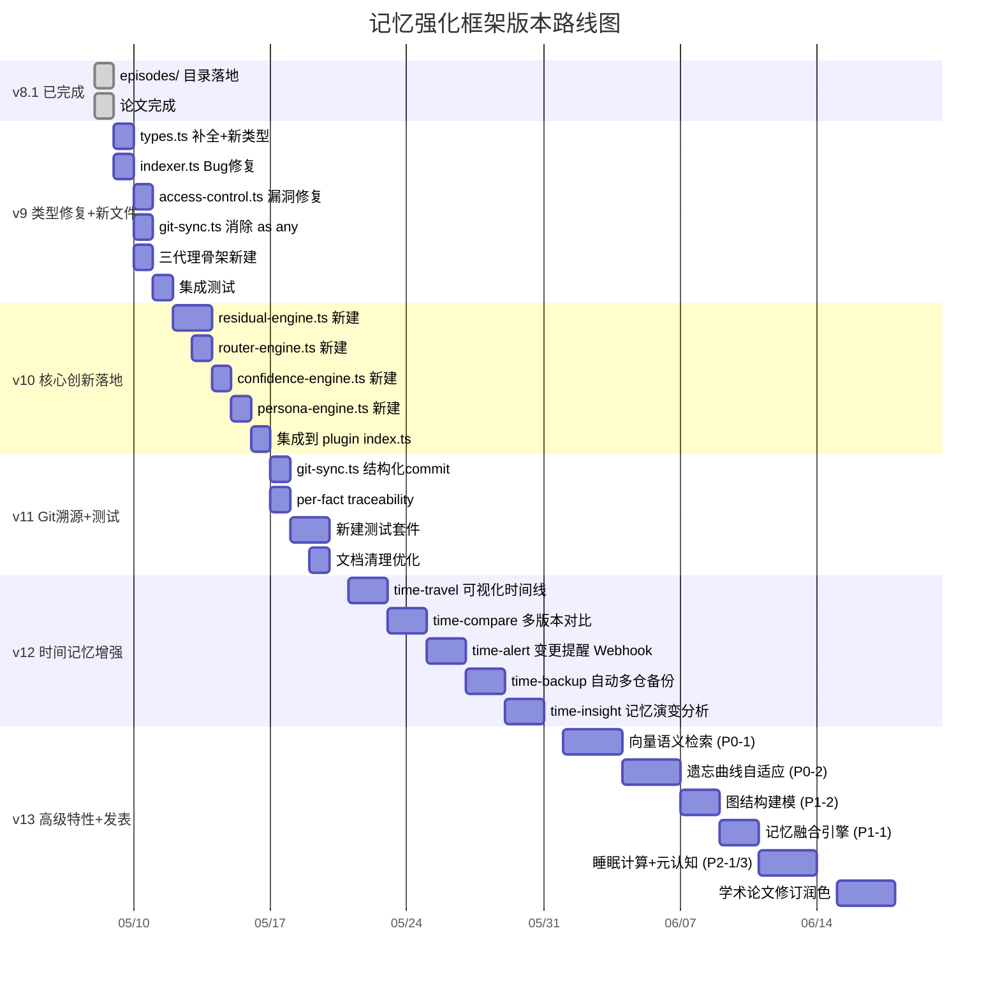
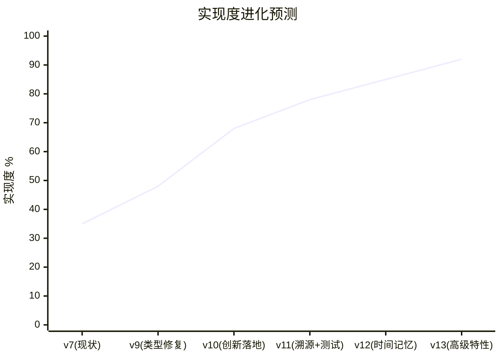

# 记忆强化框架 — 版本开发计划

> 当前版本：**v9.0** ✅ | 编制日期：2026-05-09 | 总代码实现度：48%（v9 完成）

---

## 一、现状分析

### 1.1 当前实现度

| 维度 | 论文声明 | 代码实现 | 评分 |
|------|----------|----------|------|
| 记忆存储结构 L1-L4 | 完整 | `types.ts` 定义完整, `indexer.ts` 可用 | 🟢 一致 |
| 事件总线 | 完整 | `event-bus.ts` 实现完整 | 🟢 一致 |
| 三地一致性协议 | System2↔MD↔Gitea | 基础 Git sync 可用，无溯源 | 🟡 部分 |
| 访问控制 | 仓库级权限 | 存在但有漏洞 | 🟡 部分 |
| Persona 协调 | 4专家+关键词激活 | 仅 Markdown 伪代码 | 🟡 部分 |
| 疯狂简洁 | 10文件→5文件 | 仍有 25+ 个文件 | 🟡 部分 |
| 残差趋零三层清理 | 五页方法论 | **零行代码** | 🔴 严重 |
| 自适应路由三策略 | direct/parallel/iterative | **零行代码** | 🔴 严重 |
| 置信度三级传播 | 🟢🟡🔴 + 溯源 | **零行代码** | 🔴 严重 |
| 三代理协作架构 | S2/S1/全量 | **零行代码** | 🔴 严重 |

### 1.2 已识别缺陷（P0/P1/P2）

| 优先级 | 数量 | 描述 |
|--------|------|------|
| P0 | 3 | 向量语义检索、遗忘曲线自适应、量化评估基准 |
| P1 | 3 | 记忆融合、图结构建模、Git-native 溯源 |
| P2 | 3 | 睡眠计算、记忆类型化、元认知验证 |

---

## 二、版本路线图





---

## 三、各版本详细范围

### v9 — 类型修复 + 三代理骨架（预计实现度 48%）

**目标**：修复所有已知 Bug，补全类型系统，搭建三代理通信骨架

#### 类型系统修复
| 文件 | 变更 | 说明 |
|------|------|------|
| `types.ts` | 新增字段 | `confidence`, `confidenceUpdated`, `factSource`, `traceabilityId`, `residualQueue`, `residualSize`, `ageWeight`, `memoryType`, `accessCount`, `lastAccessTime`, `confidenceChain` |
| `types.ts` | 新增类型 | `AgentInterface`, `MemoryRepresentation`, `FactPoint`, `ConfidenceMetadata`, `AgentMessage`, `QueryMessage`, `RouteDecision` |

#### Bug 修复
| 文件 | 变更 | 说明 |
|------|------|------|
| `indexer.ts` | Fix `path.relative()` | 修复相对路径计算错误 |
| `access-control.ts` | Fix 越权访问 | 修复私有仓跨网关访问漏洞 |
| `git-sync.ts` | 消除 `as any` | 替换所有类型压制为正确类型 |

#### 新建文件
| 文件 | 说明 |
|------|------|
| `system2-agent.ts` | System2 记忆代理（海绵式全量捕获） |
| `system1-agent.ts` | System1 记忆代理（淘金式精炼） |
| `full-memory-agent-client.ts` | 全量代理-Client（本地文件写入+残差调度） |
| `full-memory-agent-server.ts` | 全量代理-Server（远程同步+跨网关广播消息中枢） |
| `agent-communication.ts` | 代理间通信协议接口定义 |

#### 验收标准
- [ ] `tsc --noEmit` 零错误
- [ ] 所有 `as any` 已消除
- [ ] 私有仓跨网关访问被正确拦截
- [ ] 三代理间可收发 `AgentMessage`

---

### v10 — 核心创新落地（预计实现度 68%）

**目标**：将论文声明的三大核心创新 + Persona 协调从伪代码落地为 TypeScript 实现

#### residual-engine.ts — 残差趋零引擎
```
功能：
- R = Σ(residual_size × age_weight) 实时计算
- Layer 1（24h）：主动消解，目标消解率 ≥70%
- Layer 2（7d）：被动消解，降级存储，目标消解率 ≥90%
- Layer 3（30d）：强制清理，目标消解率 100%
- 残差队列持久化与恢复
- 定时器驱动周期检查
```

#### router-engine.ts — 自适应路由引擎
```
功能：
- classify_query() 查询分类
- direct 策略：单代理直连
- parallel 策略：多代理并行
- iterative 策略：轮询迭代
- 路由决策日志与统计
```

#### confidence-engine.ts — 置信度传播引擎
```
功能：
- 🟢 CONFIRMED / 🟡 LIKELY / 🔴 UNCERTAIN 三级标注
- 置信度链存储与更新
- 冲突检测与处理协议
- traceabilityId 溯源关联
```

#### persona-engine.ts — Persona 协调引擎
```
功能：
- 4 专家 Persona 定义（Architect/Reviewer/Critic/Integrator）
- 关键词 + Embedding 双层激活
- 多专家协作推理流水线
```

#### 集成变更
| 文件 | 说明 |
|------|------|
| `shared-memory-core/src/index.ts` | 注册全部引擎到核心 |
| `openclaw-memory-plugin/src/index.ts` | `saveMemory` / `loadMemory` 集成引擎调用 |
| `openclaw-memory-plugin/openclaw.plugin.json` | 新增工具声明 |

#### 验收标准
- [ ] 残差值 R 可实时输出，三层清理定时触发
- [ ] 路由三策略 switchable，决策日志可审计
- [ ] 所有 MemoryDocument 带置信度标注
- [ ] Persona 协作流水线端到端可用

---

### v11 — Git 溯源 + 测试建设（预计实现度 78%）

**目标**：强化 Git 可追溯性，建立测试套件，清理冗余文档

#### Git 溯源增强
| 项目 | 说明 |
|------|------|
| 结构化 commit 消息 | `[confidence][source][memoryType] summary` 格式 |
| per-fact traceability | 每条 fact 携带 `traceabilityId`，关联到具体 commit |
| commit 签名规范 | 统一 commit author，区分各代理贡献 |

#### 测试套件
| 目录 | 内容 |
|------|------|
| `tests/unit/` | 各引擎单元测试（residual/route/confidence/persona） |
| `tests/integration/` | 三代理协作集成测试 |
| `tests/e2e/` | Git sync 端到端测试 |
| `tests/benchmark/` | 索引性能基准测试 |

#### 文档清理
- [ ] `.memory-agent-files/` 删除冗余文件（目标 ≤15 文件）
- [ ] 合并 `PATH_ANALYSIS.md` 等已声明合并的文件
- [ ] 统一 `.core/` 与 `.memory-agent-files/` 的重复设计文档

#### 验收标准
- [ ] 测试覆盖率 ≥60%
- [ ] commit 消息格式规范自动校验
- [ ] `.memory-agent-files/` 文件数 ≤15

---

### v12 — 时间记忆增强（预计实现度 85%）

**目标**：实现 5 个 time-memory 子功能，构建完整的时间维度记忆能力

| 子命令 | 功能 | 输出形式 |
|--------|------|----------|
| `time-travel` | 可视化时间线，按时间轴浏览记忆演变 | TUI / HTML 时间线 |
| `time-compare` | 任意两个时间点 / 分支间的记忆差异 | diff 报告 + 统计 |
| `time-alert` | 关键记忆变更时通过 Webhook 推送通知 | Webhook / 钉钉 / 企微 |
| `time-backup` | 定时自动备份到 Gitea 多仓库 | cron 定时 + 多仓推送 |
| `time-insight` | 记忆演变统计分析报告 | Markdown 报告 |

#### 验收标准
- [ ] 5 个子命令均可独立执行
- [ ] Webhook 通知延迟 ≤30s
- [ ] 自动备份成功率 ≥99%

---

### v13 — 高级特性 + 学术发表（目标实现度 92%）

**目标**：落地剩余 P0/P1/P2 需求，完成学术论文修订

#### 高级特性
| 特性 | 优先级 | 说明 |
|------|--------|------|
| 向量语义检索 | P0 | `indexer.ts` 集成 embedding（Milvus/Qdrant/Chroma） |
| 遗忘曲线自适应 | P0 | 基于艾宾浩斯曲线的自适应 decay 参数 |
| 图结构建模 | P1 | 记忆节点 + 关系边 → 图数据库存储 |
| 记忆融合引擎 | P1 | 多源记忆自动合并去重 |
| 睡眠计算 | P2 | 空闲时段自动后台整理 |
| 元认知验证 | P2 | 记忆质量自我评估与修正 |

#### 学术发表
- [ ] 论文 v3 修订（补充实验数据 + 代码实现验证）
- [ ] 图表重新绘制（使用真实 benchmark 数据）
- [ ] 英文摘要优化
- [ ] 目标期刊 / 会议投稿

#### 验收标准
- [ ] 向量检索延迟 ≤200ms
- [ ] 图建模支持 1000+ 节点查询
- [ ] 论文-代码一致性 ≥85%

---

## 四、风险与依赖

| 风险 | 级别 | 缓解措施 |
|------|------|----------|
| v10 三引擎联动复杂度过高 | 🔴 高 | 每个引擎先独立测试，再渐进集成 |
| v13 向量数据库外部依赖 | 🟡 中 | 设计抽象接口层，支持多种后端 |
| 跨代理通信协议设计不完善 | 🟡 中 | v9 先定义接口，v10 迭代优化 |
| 时间线冲突（原计划已延期一天） | 🟢 低 | 本文档已调整为实际可行时间表 |
| 单人开发瓶颈 | 🔴 高 | 优先 v9-v11 核心范围，v12-v13 可延后 |

---

## 五、版本管理规范

| 规范 | 说明 |
|------|------|
| 版本号 | 遵循 `MAJOR.MINOR` 格式（如 9.0, 10.0） |
| 标签 | `git tag -a v9.0 -m "类型修复 + 三代理骨架"` |
| commit 格式 | `[模块] 简短描述`（如 `[types] 补全论文声明的缺失字段`） |
| 发布分支 | `main` 分支始终为最新稳定版 |
| package 版本 | 插件 `package.json` version 与框架版本同步 |
| VERSION 文件 | 每次发布更新 |

---

## 六、当前行动项（2026-05-09 立即执行）

- [x] **P0** `types.ts` — 为 `MemoryDocument` 补全 10 个缺失字段
- [x] **P0** `types.ts` — 新增 `AgentInterface`, `ConfidenceMetadata`, `FactPoint` 类型
- [x] **P0** `indexer.ts` — 修复 `path.relative()` bug
- [x] **P1** `access-control.ts` — 修复私有仓越权访问
- [x] **P1** `git-sync.ts` — 消除所有 `as any`
- [x] **P1** 新建 `system2-agent.ts` / `system1-agent.ts` 骨架
- [x] **P1** 新建 `full-memory-agent-client.ts` / `full-memory-agent-server.ts`
- [x] **P1** 新建 `agent-communication.ts` 接口定义

---

> 计划跟踪：更新本文档 `[x]` 标记完成项 | 偏差 >20% 时修订时间线
