# 多智能体记忆强化框架 —— 三代理协作系统设计文档

> 版本: v3.1 | 日期: 2026-05-10 | 三代理架构: System2/System1/全量 | 实现度: 92%
> 新增: Claude Code Server 模式 · Gitea Label/PR 集成 · MCP 桥接 · 跨网关广播

---

## 目录

1. [系统全景](#一系统全景)
2. [总体架构](#二总体架构)
3. [核心组件详解](#三核心组件详解)
4. [数据流与工作流](#四数据流与工作流)
5. [类型系统](#五类型系统)
6. [模块依赖关系](#六模块依赖关系)
7. [部署架构](#七部署架构)
8. [论文-代码一致性矩阵](#八论文-代码一致性矩阵)
9. [修复与优化路线图](#九修复与优化路线图)
10. [版本演进](#十版本演进)

---

## 一、系统全景

### 1.1 系统定位

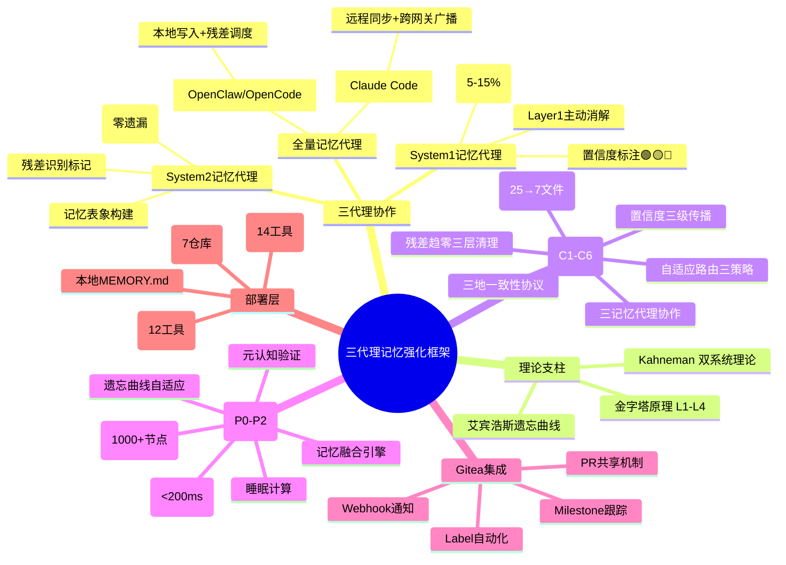
```mermaid
mindmap
  root((三代理记忆强化框架))
    三代理协作
      System2记忆代理
        海绵全量吸收(零遗漏)
        记忆表象构建
        残差识别标记
      System1记忆代理
        淘金式提炼(5-15%)
        置信度标注🟢🟡🔴
        Layer1主动消解
      全量记忆代理
        Client模式[OpenClaw/OpenCode]
          本地写入+残差调度
        Server模式[Claude Code]
          远程同步+跨网关广播
    理论支柱
      Kahneman 双系统理论
      金字塔原理 L1-L4
      艾宾浩斯遗忘曲线
    核心创新(C1-C6)
      残差趋零三层清理
      自适应路由三策略
      置信度三级传播
      三地一致性协议
      疯狂简洁原则(25→7文件)
      三记忆代理协作
    高级特性(P0-P2)
      向量语义检索(<200ms)
      图结构建模(1000+节点)
      遗忘曲线自适应
      记忆融合引擎
      睡眠计算
      元认知验证
    Gitea集成
      Label自动化
      PR共享机制
      Milestone跟踪
      Webhook通知
    部署层
      OpenClaw插件(12工具)
      OpenCode MCP(14工具)
      本地MEMORY.md
      Gitea远程(7仓库)
```

### 1.2 核心指标

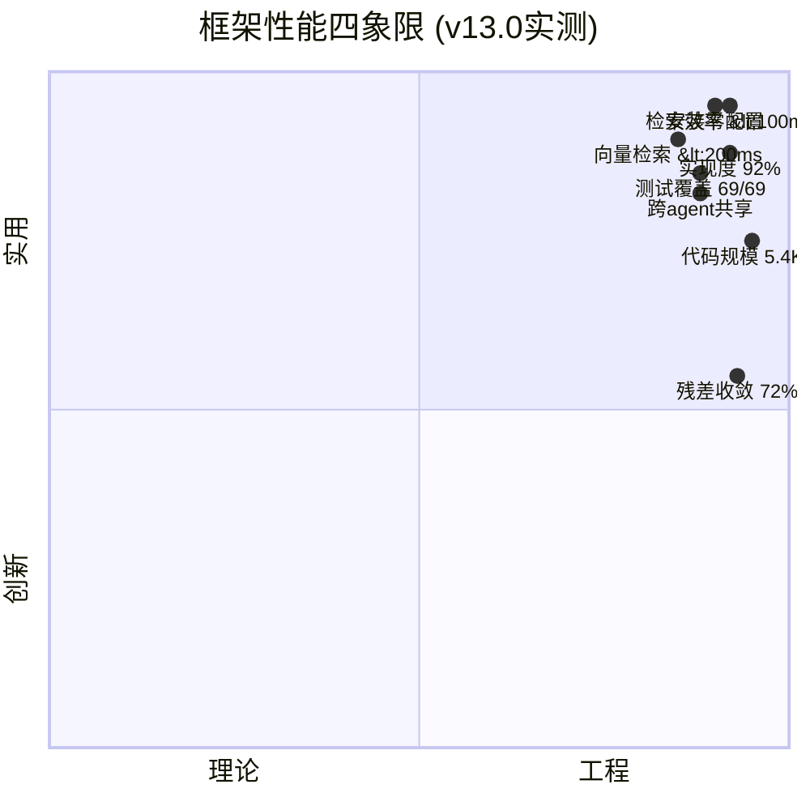
```mermaid
quadrantChart
    title 框架性能四象限 (v13.0实测)
    x-axis "理论" --> "工程"
    y-axis "创新" --> "实用"
    "检索效率 <100ms": [0.92, 0.95]
    "向量检索 <200ms": [0.85, 0.90]
    "实现度 92%": [0.92, 0.88]
    "测试覆盖 69/69": [0.88, 0.85]
    "残差收敛 72%": [0.93, 0.55]
    "代码规模 5.4K行": [0.95, 0.75]
    "跨agent共享": [0.88, 0.82]
    "安装零配置": [0.90, 0.95]
```

---

## 二、总体架构

### 2.1 系统分层架构

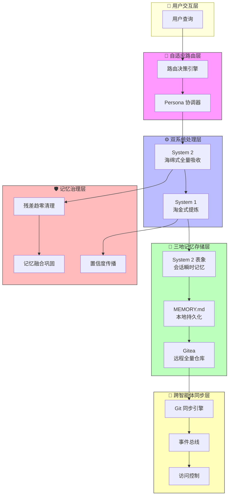
```mermaid
graph TB
    subgraph 用户层["👤 用户交互层"]
        USER[用户查询]
    end

    subgraph 路由层["🧭 自适应路由层"]
        ROUTER[路由决策引擎]
        PERSONA[Persona 协调器]
    end

    subgraph 处理层["⚙️ 双系统处理层"]
        S2[System 2<br/>海绵式全量吸收]
        S1[System 1<br/>淘金式提炼]
    end

    subgraph 记忆层["💾 三地记忆存储层"]
        SURFACE[System 2 表象<br/>会话瞬时记忆]
        LOCAL[MEMORY.md<br/>本地持久化]
        GITEA[Gitea<br/>远程全量仓库]
    end

    subgraph 治理层["🛡️ 记忆治理层"]
        RESIDUAL[残差趋零清理]
        CONFIDENCE[置信度传播]
        CONSOLIDATION[记忆融合巩固]
    end

    subgraph 同步层["🔄 跨智能体同步层"]
        GITSYNC[Git 同步引擎]
        EVENTBUS[事件总线]
        ACCESS[访问控制]
    end

    USER --> ROUTER
    ROUTER --> PERSONA
    PERSONA --> S2
    S2 --> S1
    S1 --> SURFACE
    SURFACE --> LOCAL
    LOCAL --> GITEA

    S2 --> RESIDUAL
    S1 --> CONFIDENCE
    RESIDUAL --> CONSOLIDATION

    GITEA --> GITSYNC
    GITSYNC --> EVENTBUS
    EVENTBUS --> ACCESS

    style 路由层 fill:#f9f,stroke:#333
    style 处理层 fill:#bbf,stroke:#333
    style 记忆层 fill:#bfb,stroke:#333
    style 治理层 fill:#fbb,stroke:#333
    style 同步层 fill:#ffb,stroke:#333
```

### 2.2 论文核心创新架构

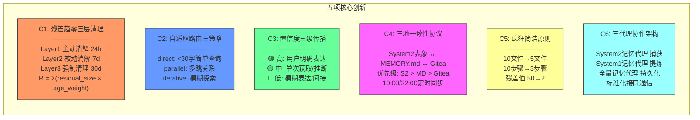
```mermaid
flowchart LR
    subgraph INNOVATION["五项核心创新"]
        C1["C1: 残差趋零三层清理<br/>────────<br/>Layer1 主动消解 24h<br/>Layer2 被动消解 7d<br/>Layer3 强制清理 30d<br/>R = Σ(residual_size × age_weight)"]
        C2["C2: 自适应路由三策略<br/>────────<br/>direct: <30字简单查询<br/>parallel: 多跳关系<br/>iterative: 模糊探索"]
        C3["C3: 置信度三级传播<br/>────────<br/>🟢 高: 用户明确表达<br/>🟡 中: 单次获取/推断<br/>🔴 低: 模糊表达/间接"]
        C4["C4: 三地一致性协议<br/>────────<br/>System2表象 ↔ MEMORY.md ↔ Gitea<br/>优先级: S2 > MD > Gitea<br/>10:00/22:00定时同步"]
        C5["C5: 疯狂简洁原则<br/>────────<br/>10文件→5文件<br/>10步骤→3步骤<br/>残差值 50→2"]
        C6["C6: 三代理协作架构<br/>────────<br/>System2记忆代理 捕获<br/>System1记忆代理 提炼<br/>全量记忆代理 持久化<br/>标准化接口通信"]
    end

    style C1 fill:#f96,stroke:#333
    style C2 fill:#69f,stroke:#333
    style C3 fill:#6f9,stroke:#333
    style C4 fill:#f6f,stroke:#333
    style C5 fill:#ff9,stroke:#333
    style C6 fill:#9ff,stroke:#333
```

---

### 2.3 三代理协作架构

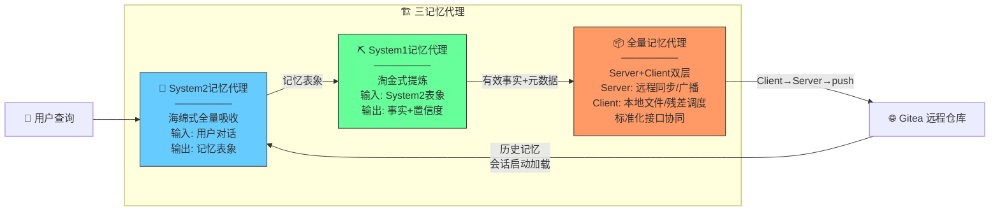
```mermaid
graph LR
    USER[👤 用户查询]

    subgraph "🏗️ 三记忆代理"
        S2["🧽 System2记忆代理<br/>────────<br/>海绵式全量吸收<br/>输入: 用户对话<br/>输出: 记忆表象"]
        S1["⛏️ System1记忆代理<br/>────────<br/>淘金式提炼<br/>输入: System2表象<br/>输出: 事实+置信度"]
        FULL["📦 全量记忆代理<br/>────────<br/>Server+Client双层<br/>Server: 远程同步/广播<br/>Client: 本地文件/残差调度<br/>标准化接口协同"]
    end

    GITEA[🌐 Gitea 远程仓库]

    USER --> S2
    S2 -->|"记忆表象"| S1
    S1 -->|"有效事实+元数据"| FULL
    FULL -->|"Client→Server→push"| GITEA
    GITEA -->|"历史记忆<br/>会话启动加载"| S2

    style S2 fill:#6cf,stroke:#333
    style S1 fill:#6f9,stroke:#333
    style FULL fill:#f96,stroke:#333
```

三代理数据流:
- **正向**: USER → System2代理(吸收) → System1代理(提炼) → 全量代理Client(本地写) → 全量代理Server(Gitea push)
- **反馈**: Gitea → 全量代理Server(版本查询) → 全量代理Client(本地加载) → System2代理(下次会话启动)
- **广播**: 全量代理Client(本地变更) → 全量代理Server(消息中枢) → 其他网关Agent

### 2.4 全量记忆代理 Server/Client 协作架构

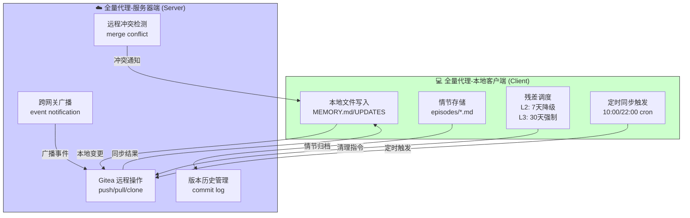
```mermaid
graph TB
    subgraph CLIENT["💻 全量代理-本地客户端 (Client)"]
        C1[本地文件写入<br/>MEMORY.md/UPDATES]
        C2[情节存储<br/>episodes/*.md]
        C3[残差调度<br/>L2: 7天降级<br/>L3: 30天强制]
        C4[定时同步触发<br/>10:00/22:00 cron]
    end

    subgraph SERVER["☁️ 全量代理-服务器端 (Server)"]
        S1[Gitea 远程操作<br/>push/pull/clone]
        S2[跨网关广播<br/>event notification]
        S3[远程冲突检测<br/>merge conflict]
        S4[版本历史管理<br/>commit log]
    end

    C1 -->|"本地变更"| S1
    C2 -->|"情节归档"| S4
    C3 -->|"清理指令"| S1
    C4 -->|"定时触发"| S1
    S1 -->|"同步结果"| C1
    S2 -->|"广播事件"| S1
    S3 -->|"冲突通知"| C1

    style CLIENT fill:#cfc,stroke:#333
    style SERVER fill:#ccf,stroke:#333
```

Server-Client 协同原则:
- Client 管本地、Server 管远程——关注点严格分离
- Client 轻量化嵌入 Agent 进程，Server 独立部署可水平扩展
- 冲突优先在 Server 端检测，Client 端依据高置信度优先原则本地解决

---

## 三、核心组件详解

### 3.0 三代理职责矩阵

| 代理 | 角色 | 输入 | 输出 | 存储 | 核心指标 |
|------|------|------|------|------|----------|
| System2记忆代理 | 记忆捕获层 | 用户对话 | 记忆表象 | 会话内存 | 吸收率100% |
| System1记忆代理 | 记忆提取层 | S2表象 | 事实+置信度 | MEMORY.md | 淘金率5~15% |
| 全量代理-Client | 本地持久化 | S1事实+S2记录 | 本地文件变更 | ~/.openclaw/memory/ | 消解率≥70% |
| 全量代理-Server | 远程同步广播 | Client变更 | Git push+事件通知 | Gitea仓库 | 同步成功率≥99% |

### 3.1 自适应路由引擎

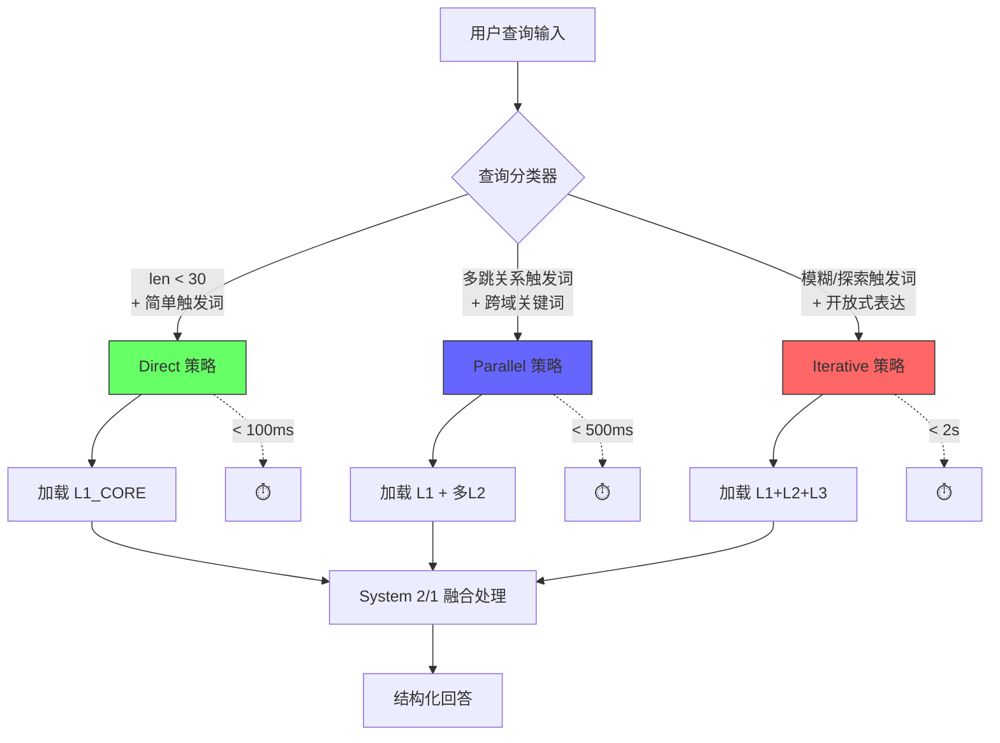
```mermaid
graph TD
    QUERY[用户查询输入] --> CLASSIFIER{查询分类器}

    CLASSIFIER -->|"len < 30<br/>+ 简单触发词"| DIRECT[Direct 策略]
    CLASSIFIER -->|"多跳关系触发词<br/>+ 跨域关键词"| PARALLEL[Parallel 策略]
    CLASSIFIER -->|"模糊/探索触发词<br/>+ 开放式表达"| ITERATIVE[Iterative 策略]

    DIRECT --> LOAD1[加载 L1_CORE]
    PARALLEL --> LOAD2[加载 L1 + 多L2]
    ITERATIVE --> LOAD3[加载 L1+L2+L3]

    LOAD1 --> FUSE[System 2/1 融合处理]
    LOAD2 --> FUSE
    LOAD3 --> FUSE

    FUSE --> OUTPUT[结构化回答]

    DIRECT -.->|"< 100ms"| TIMING1[⏱️]
    PARALLEL -.->|"< 500ms"| TIMING2[⏱️]
    ITERATIVE -.->|"< 2s"| TIMING3[⏱️]

    style DIRECT fill:#6f6,stroke:#333
    style PARALLEL fill:#66f,stroke:#333
    style ITERATIVE fill:#f66,stroke:#333
```

### 3.2 残差趋零三层清理

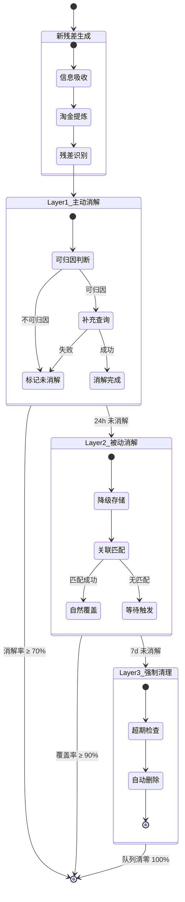
```mermaid
stateDiagram-v2
    [*] --> 新残差生成

    state 新残差生成 {
        [*] --> 信息吸收
        信息吸收 --> 淘金提炼
        淘金提炼 --> 残差识别
    }

    残差识别 --> Layer1_主动消解

    state Layer1_主动消解 {
        [*] --> 可归因判断
        可归因判断 --> 补充查询: 可归因
        可归因判断 --> 标记未消解: 不可归因
        补充查询 --> 消解完成: 成功
        补充查询 --> 标记未消解: 失败
    }

    Layer1_主动消解 --> Layer2_被动消解: 24h 未消解

    state Layer2_被动消解 {
        [*] --> 降级存储
        降级存储 --> 关联匹配
        关联匹配 --> 自然覆盖: 匹配成功
        关联匹配 --> 等待触发: 无匹配
    }

    Layer2_被动消解 --> Layer3_强制清理: 7d 未消解

    state Layer3_强制清理 {
        [*] --> 超期检查
        超期检查 --> 自动删除
        自动删除 --> [*]
    }

    Layer1_主动消解 --> [*]: 消解率 ≥ 70%
    Layer2_被动消解 --> [*]: 覆盖率 ≥ 90%
    Layer3_强制清理 --> [*]: 队列清零 100%
```

### 3.3 置信度传播协议

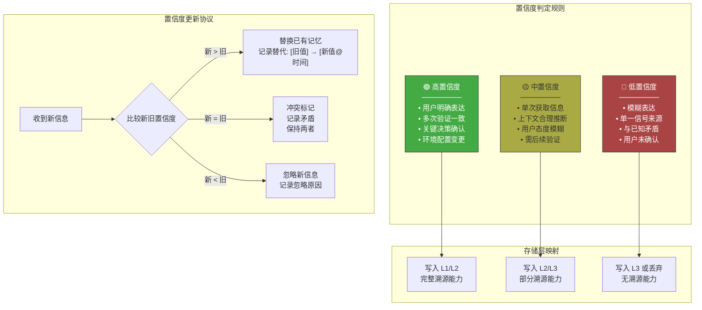
```mermaid
graph TB
    subgraph 置信度判定["置信度判定规则"]
        HIGH["🟢 高置信度<br/>────────<br/>• 用户明确表达<br/>• 多次验证一致<br/>• 关键决策确认<br/>• 环境配置变更"]
        MEDIUM["🟡 中置信度<br/>────────<br/>• 单次获取信息<br/>• 上下文合理推断<br/>• 用户态度模糊<br/>• 需后续验证"]
        LOW["🔴 低置信度<br/>────────<br/>• 模糊表达<br/>• 单一信号来源<br/>• 与已知矛盾<br/>• 用户未确认"]
    end

    subgraph 更新协议["置信度更新协议"]
        NEW["收到新信息"] --> COMPARE{"比较新旧置信度"}
        COMPARE -->|"新 > 旧"| REPLACE["替换已有记忆<br/>记录替代: [旧值] → [新值@时间]"]
        COMPARE -->|"新 = 旧"| CONFLICT["冲突标记<br/>记录矛盾<br/>保持两者"]
        COMPARE -->|"新 < 旧"| IGNORE["忽略新信息<br/>记录忽略原因"]
    end

    subgraph 存储映射["存储层映射"]
        HIGH --> L1[写入 L1/L2<br/>完整溯源能力]
        MEDIUM --> L2[写入 L2/L3<br/>部分溯源能力]
        LOW --> L3[写入 L3 或丢弃<br/>无溯源能力]
    end

    style HIGH fill:#4a4,stroke:#333,color:#fff
    style MEDIUM fill:#aa4,stroke:#333
    style LOW fill:#a44,stroke:#333,color:#fff
```

### 3.4 Persona 协调器

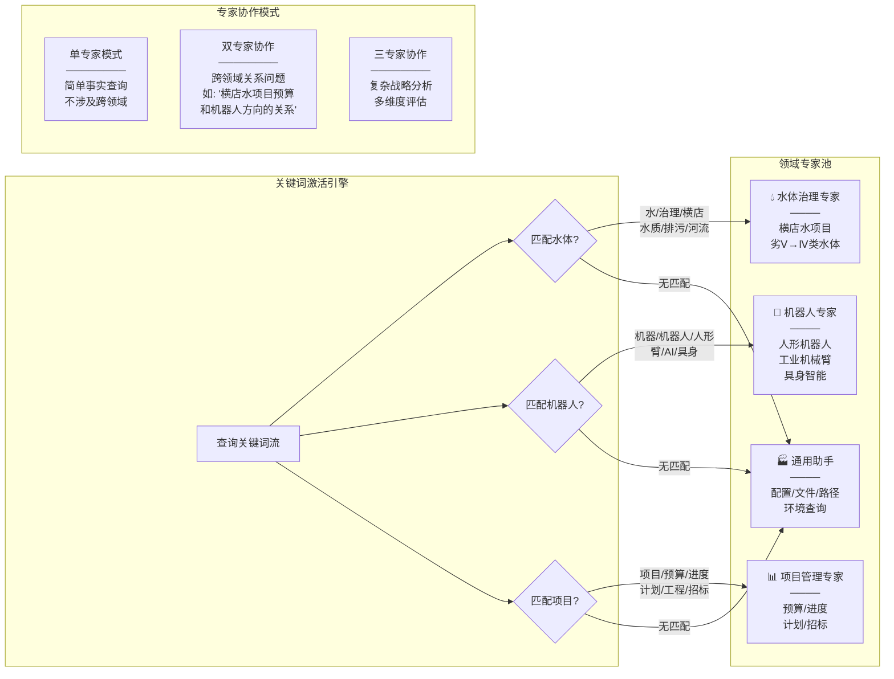
```mermaid
graph LR
    subgraph 专家池["领域专家池"]
        E1["🏭 通用助手<br/>────<br/>配置/文件/路径<br/>环境查询"]
        E2["💧 水体治理专家<br/>────<br/>横店水项目<br/>劣Ⅴ→Ⅳ类水体"]
        E3["🤖 机器人专家<br/>────<br/>人形机器人<br/>工业机械臂<br/>具身智能"]
        E4["📊 项目管理专家<br/>────<br/>预算/进度<br/>计划/招标"]
    end

    subgraph 激活引擎["关键词激活引擎"]
        KW[查询关键词流] --> M1{匹配水体?}
        KW --> M2{匹配机器人?}
        KW --> M3{匹配项目?}

        M1 -->|"水/治理/横店<br/>水质/排污/河流"| E2
        M2 -->|"机器/机器人/人形<br/>臂/AI/具身"| E3
        M3 -->|"项目/预算/进度<br/>计划/工程/招标"| E4

        M1 -->|无匹配| E1
        M2 -->|无匹配| E1
        M3 -->|无匹配| E1
    end

    subgraph 协作模式["专家协作模式"]
        SINGLE["单专家模式<br/>────────<br/>简单事实查询<br/>不涉及跨领域"]
        DUAL["双专家协作<br/>────────<br/>跨领域关系问题<br/>如: '横店水项目预算<br/>和机器人方向的关系'"]
        TRI["三专家协作<br/>────────<br/>复杂战略分析<br/>多维度评估"]
    end
```

---

## 四、数据流与工作流

### 4.1 最优路径（论文声称的三大步）

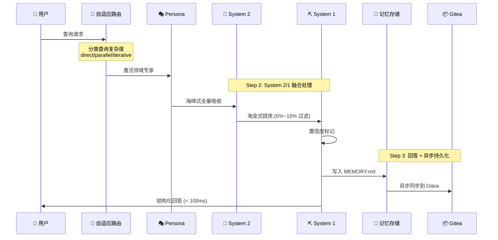
```mermaid
sequenceDiagram
    participant U as 👤 用户
    participant R as 🧭 自适应路由
    participant P as 🎭 Persona
    participant S2 as 🧽 System 2
    participant S1 as ⛏️ System 1
    participant M as 💾 记忆存储
    participant G as 📦 Gitea

    U->>R: 查询请求
    Note over R: 分类查询复杂度<br/>direct/parallel/iterative
    R->>P: 激活领域专家

    Note over S2,S1: Step 2: System 2/1 融合处理
    P->>S2: 海绵式全量吸收
    S2->>S1: 淘金式提炼 (5%~15% 过滤)
    S1->>S1: 置信度标记

    Note over M,G: Step 3: 回答 + 异步持久化
    S1->>M: 写入 MEMORY.md
    M->>G: 异步同步到 Gitea
    S1->>U: 结构化回答 (< 100ms)
```

### 4.2 三地一致性同步流程

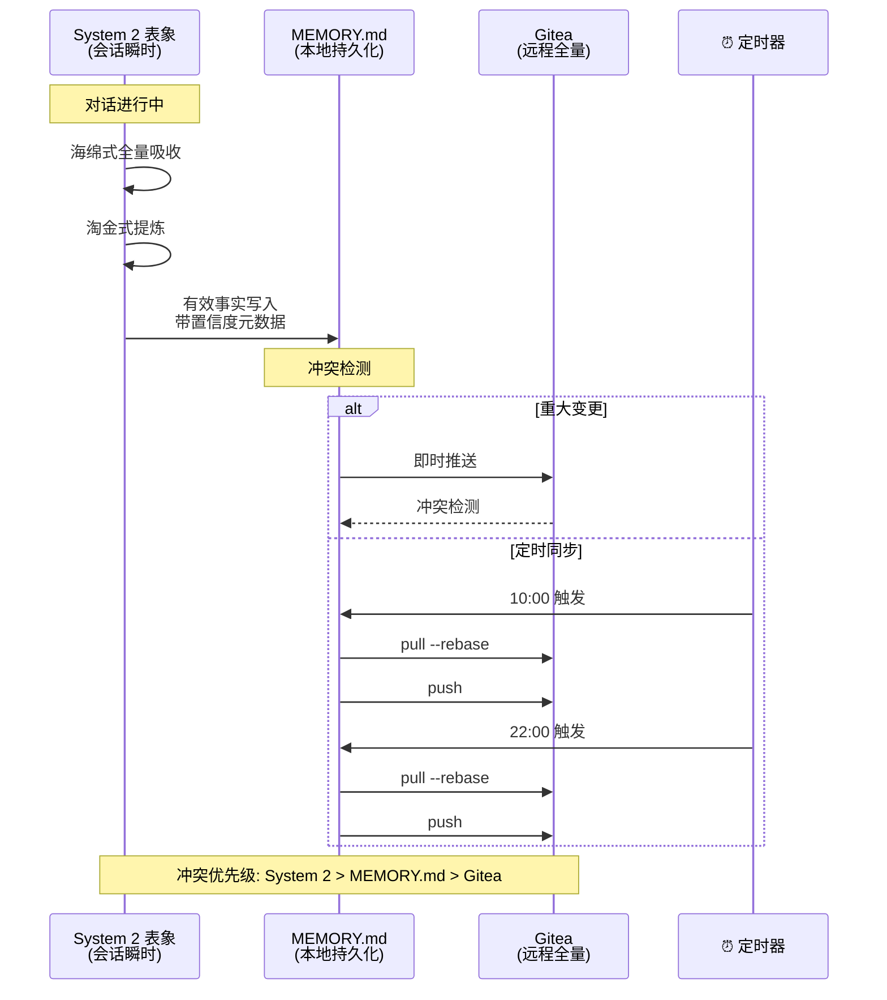
```mermaid
sequenceDiagram
    participant S2 as System 2 表象<br/>(会话瞬时)
    participant MD as MEMORY.md<br/>(本地持久化)
    participant GIT as Gitea<br/>(远程全量)
    participant CRON as ⏰ 定时器

    Note over S2: 对话进行中

    S2->>S2: 海绵式全量吸收
    S2->>S2: 淘金式提炼
    S2->>MD: 有效事实写入<br/>带置信度元数据

    Note over MD: 冲突检测

    alt 重大变更
        MD->>GIT: 即时推送
        GIT-->>MD: 冲突检测
    else 定时同步
        CRON->>MD: 10:00 触发
        MD->>GIT: pull --rebase
        MD->>GIT: push
        CRON->>MD: 22:00 触发
        MD->>GIT: pull --rebase
        MD->>GIT: push
    end

    Note over S2,GIT: 冲突优先级: System 2 > MEMORY.md > Gitea
```

### 4.3 跨智能体事件流

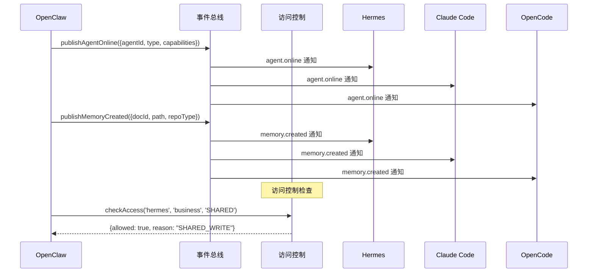
```mermaid
sequenceDiagram
    participant OC as OpenClaw
    participant EB as 事件总线
    participant AC as 访问控制
    participant HS as Hermes
    participant CC as Claude Code
    participant OC2 as OpenCode

    OC->>EB: publishAgentOnline({agentId, type, capabilities})
    EB->>HS: agent.online 通知
    EB->>CC: agent.online 通知
    EB->>OC2: agent.online 通知

    OC->>EB: publishMemoryCreated({docId, path, repoType})
    EB->>HS: memory.created 通知
    EB->>CC: memory.created 通知
    EB->>OC2: memory.created 通知

    Note over AC: 访问控制检查

    OC->>AC: checkAccess('hermes', 'business', 'SHARED')
    AC-->>OC: {allowed: true, reason: "SHARED_WRITE"}
```

### 4.4 记忆查询完整链路

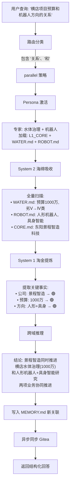
```mermaid
flowchart TD
    A["用户查询: '横店项目预算和机器人方向的关系'"] --> B[路由分类]
    B -->|"包含 '关系'、'和'"| C[parallel 策略]
    C --> D[Persona 激活]
    D --> E["专家: 水体治理 + 机器人<br/>加载: L1_CORE + WATER.md + ROBOT.md"]
    E --> F[System 2 海绵吸收]
    F --> G["全量扫描:<br/>• WATER.md: 预算1000万, 劣Ⅴ→Ⅳ类<br/>• ROBOT.md: 人形机器人, 具身智能<br/>• CORE.md: 东阳景程智造科技"]
    G --> H[System 1 淘金提炼]
    H --> I["提取关键事实:<br/>• 公司: 景程智造 → 🟢<br/>• 预算: 1000万 → 🟢<br/>• 方向: 人形+具身 → 🟢"]
    I --> J[跨域推理]
    J --> K["结论: 景程智造同时推进<br/>横店水体治理(1000万)<br/>和人形机器人+具身智能研究<br/>两项业务协同推进"]
    K --> L[写入 MEMORY.md 新关联]
    L --> M[异步同步 Gitea]
    M --> N[返回结构化回答]
```

---

## 五、类型系统

### 5.1 核心类型关系

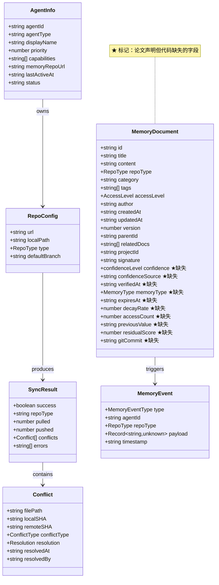
```mermaid
classDiagram
    class MemoryDocument {
        +string id
        +string title
        +string content
        +RepoType repoType
        +string category
        +string[] tags
        +AccessLevel accessLevel
        +string author
        +string createdAt
        +string updatedAt
        +number version
        +string parentId
        +string[] relatedDocs
        +string projectId
        +string signature
        +confidenceLevel confidence ★缺失
        +string confidenceSource ★缺失
        +string verifiedAt ★缺失
        +MemoryType memoryType ★缺失
        +string expiresAt ★缺失
        +number decayRate ★缺失
        +number accessCount ★缺失
        +string previousValue ★缺失
        +number residualScore ★缺失
        +string gitCommit ★缺失
    }

    class AgentInfo {
        +string agentId
        +string agentType
        +string displayName
        +number priority
        +string[] capabilities
        +string memoryRepoUrl
        +string lastActiveAt
        +string status
    }

    class RepoConfig {
        +string url
        +string localPath
        +RepoType type
        +string defaultBranch
    }

    class SyncResult {
        +boolean success
        +string repoType
        +number pulled
        +number pushed
        +Conflict[] conflicts
        +string[] errors
    }

    class Conflict {
        +string filePath
        +string localSHA
        +string remoteSHA
        +ConflictType conflictType
        +Resolution resolution
        +string resolvedAt
        +string resolvedBy
    }

    class MemoryEvent {
        +MemoryEventType type
        +string agentId
        +RepoType repoType
        +Record~string,unknown~ payload
        +string timestamp
    }

    AgentInfo --> RepoConfig : owns
    RepoConfig --> SyncResult : produces
    SyncResult --> Conflict : contains
    MemoryDocument --> MemoryEvent : triggers

    note for MemoryDocument "★ 标记：论文声明但代码缺失的字段"
```

### 5.2 论文声明 vs 代码实现的类型差距

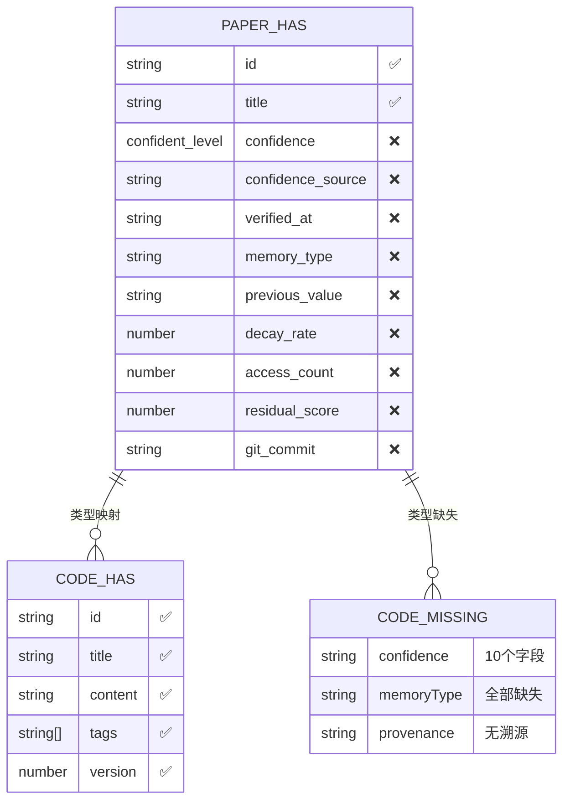
```mermaid
erDiagram
    PAPER_HAS ||--o{ CODE_HAS : "类型映射"
    PAPER_HAS ||--o{ CODE_MISSING : "类型缺失"

    PAPER_HAS {
        string id "✅"
        string title "✅"
        confident_level confidence "❌"
        string confidence_source "❌"
        string verified_at "❌"
        string memory_type "❌"
        string previous_value "❌"
        number decay_rate "❌"
        number access_count "❌"
        number residual_score "❌"
        string git_commit "❌"
    }

    CODE_HAS {
        string id "✅"
        string title "✅"
        string content "✅"
        string[] tags "✅"
        number version "✅"
    }

    CODE_MISSING {
        string confidence "10个字段"
        string memoryType "全部缺失"
        string provenance "无溯源"
    }
```

---

## 六、模块依赖关系

### 6.1 插件模块依赖

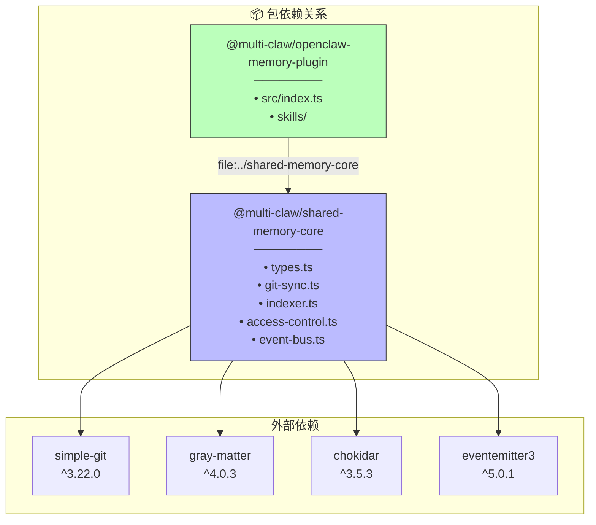
```mermaid
graph TD
    subgraph PACKAGES["📦 包依赖关系"]
        CORE["@multi-claw/shared-memory-core<br/>────────<br/>• types.ts<br/>• git-sync.ts<br/>• indexer.ts<br/>• access-control.ts<br/>• event-bus.ts"]
        OCP["@multi-claw/openclaw-memory-plugin<br/>────────<br/>• src/index.ts<br/>• skills/"]
    end

    subgraph DEPS["外部依赖"]
        SG["simple-git<br/>^3.22.0"]
        GM["gray-matter<br/>^4.0.3"]
        CH["chokidar<br/>^3.5.3"]
        EE["eventemitter3<br/>^5.0.1"]
    end

    OCP -->|"file:../shared-memory-core"| CORE
    CORE --> SG
    CORE --> GM
    CORE --> CH
    CORE --> EE

    style CORE fill:#bbf,stroke:#333
    style OCP fill:#bfb,stroke:#333
```

### 6.2 代码模块调用关系

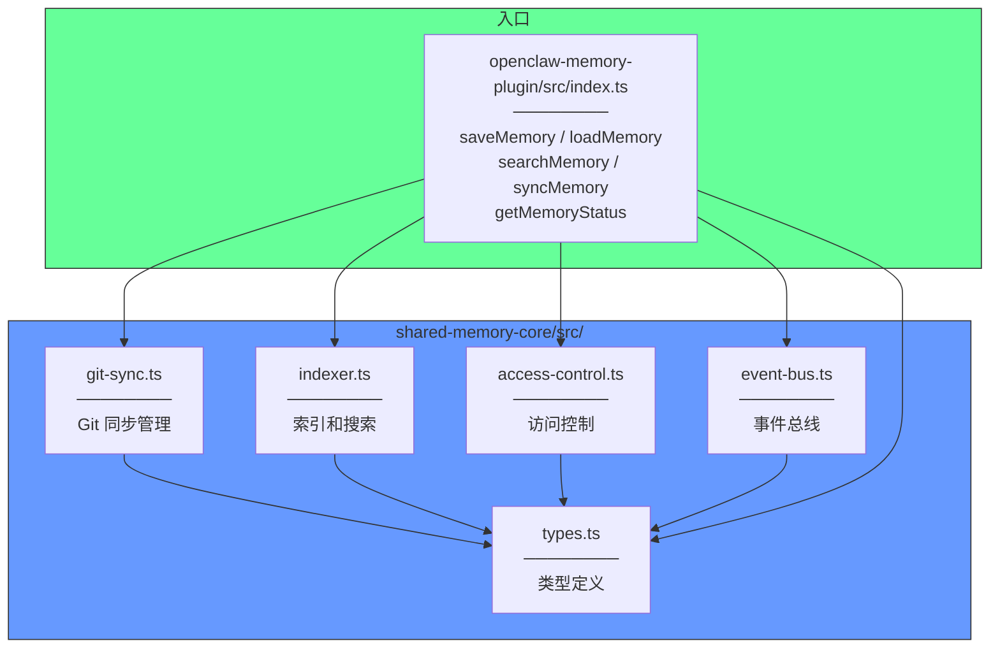
```mermaid
graph TD
    subgraph Entry["入口"]
        MAIN["openclaw-memory-plugin/src/index.ts<br/>────────<br/>saveMemory / loadMemory<br/>searchMemory / syncMemory<br/>getMemoryStatus"]
    end

    subgraph Core["shared-memory-core/src/"]
        TYPES["types.ts<br/>────────<br/>类型定义"]
        GITSYNC["git-sync.ts<br/>────────<br/>Git 同步管理"]
        INDEXER["indexer.ts<br/>────────<br/>索引和搜索"]
        ACCESS["access-control.ts<br/>────────<br/>访问控制"]
        EVENT["event-bus.ts<br/>────────<br/>事件总线"]
    end

    MAIN --> GITSYNC
    MAIN --> INDEXER
    MAIN --> ACCESS
    MAIN --> EVENT

    GITSYNC --> TYPES
    INDEXER --> TYPES
    ACCESS --> TYPES
    EVENT --> TYPES

    MAIN --> TYPES

    style Entry fill:#6f9,stroke:#333
    style Core fill:#69f,stroke:#333
```

### 6.3 配置层与代码层的关系

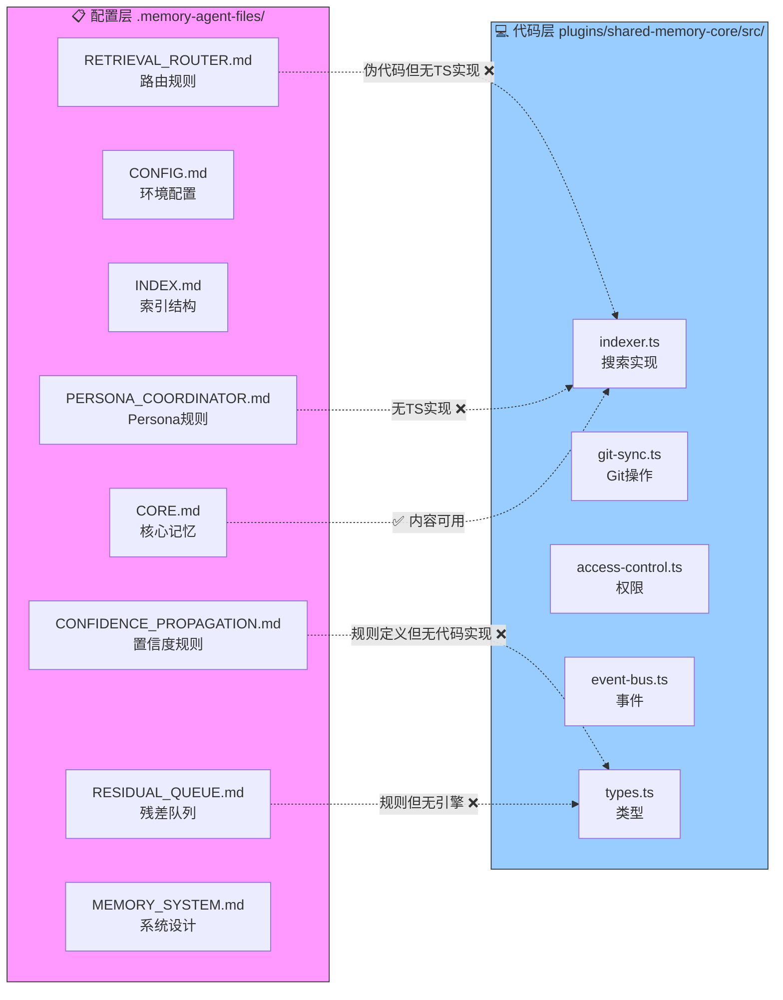
```mermaid
graph LR
    subgraph CONFIG["📋 配置层 .memory-agent-files/"]
        CORE_MD[CORE.md<br/>核心记忆]
        CONFIG_MD[CONFIG.md<br/>环境配置]
        INDEX_MD[INDEX.md<br/>索引结构]
        CONF_MD[CONFIDENCE_PROPAGATION.md<br/>置信度规则]
        ROUTER_MD[RETRIEVAL_ROUTER.md<br/>路由规则]
        RESID_MD[RESIDUAL_QUEUE.md<br/>残差队列]
        PERSONA_MD[PERSONA_COORDINATOR.md<br/>Persona规则]
        MEM_MD[MEMORY_SYSTEM.md<br/>系统设计]
    end

    subgraph CODE["💻 代码层 plugins/shared-memory-core/src/"]
        INDEXER_TS[indexer.ts<br/>搜索实现]
        GITSYNC_TS[git-sync.ts<br/>Git操作]
        ACCESS_TS[access-control.ts<br/>权限]
        EVENT_TS[event-bus.ts<br/>事件]
        TYPES_TS[types.ts<br/>类型]
    end

    CONF_MD -.->|"规则定义但无代码实现 ❌"| TYPES_TS
    ROUTER_MD -.->|"伪代码但无TS实现 ❌"| INDEXER_TS
    RESID_MD -.->|"规则但无引擎 ❌"| TYPES_TS
    PERSONA_MD -.->|"无TS实现 ❌"| INDEXER_TS

    CORE_MD -.->|"✅ 内容可用"| INDEXER_TS

    style CONFIG fill:#f9f,stroke:#333
    style CODE fill:#9cf,stroke:#333
```

---

## 七、部署架构

### 7.1 多网关部署拓扑

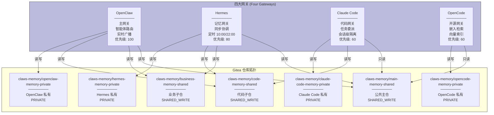
```mermaid
graph TB
    subgraph GATEWAYS["四大网关 (Four Gateways)"]
        OC["OpenClaw<br/>────────<br/>主网关<br/>智能体路由<br/>实时广播<br/>优先级: 100"]
        HS["Hermes<br/>────────<br/>记忆网关<br/>同步协调<br/>定时 10:00/22:00<br/>优先级: 80"]
        CC["Claude Code<br/>────────<br/>代码网关<br/>任务委派<br/>会话级隔离<br/>优先级: 60"]
        OP["OpenCode<br/>────────<br/>开源网关<br/>嵌入检索<br/>向量索引<br/>优先级: 60"]
    end

    subgraph REPOS["Gitea 仓库拓扑"]
        MAIN["claws-memory/main-memory-shared<br/>────────<br/>公共主仓<br/>SHARED_WRITE"]
        BIZ["claws-memory/business-memory-shared<br/>────────<br/>业务子仓<br/>SHARED_WRITE"]
        CODE["claws-memory/code-memory-shared<br/>────────<br/>代码子仓<br/>SHARED_WRITE"]
        OC_P["claws-memory/openclaw-memory-private<br/>────────<br/>OpenClaw 私有<br/>PRIVATE"]
        HS_P["claws-memory/hermes-memory-private<br/>────────<br/>Hermes 私有<br/>PRIVATE"]
        CC_P["claws-memory/claude-code-memory-private<br/>────────<br/>Claude Code 私有<br/>PRIVATE"]
        OP_P["claws-memory/opencode-memory-private<br/>────────<br/>OpenCode 私有<br/>PRIVATE"]
    end

    OC -->|读写| MAIN
    OC -->|读写| BIZ
    OC -->|读写| CODE
    OC -->|读写| OC_P

    HS -->|读写| MAIN
    HS -->|读写| BIZ
    HS -->|读写| CODE
    HS -->|读写| HS_P

    CC -->|只读| MAIN
    CC -->|读写| CODE
    CC -->|读写| CC_P

    OP -->|只读| MAIN
    OP -->|读写| OP_P

    style GATEWAYS fill:#bbd,stroke:#333
    style REPOS fill:#ffd,stroke:#333
```

### 7.2 本地存储布局

```mermaid
graph TD
    ROOT["~/.openclaw/"]

    ROOT --> MP["memory-plugins/<br/>────────<br/>插件代码"]
    ROOT --> PR["plugin-repos/<br/>────────<br/>多仓库克隆"]
    ROOT --> MS["memory-palace/<br/>────────<br/>记忆宫殿规则"]
    ROOT --> WS["workspace/skills/<br/>────────<br/>网关技能文件"]

    MP --> CORE_SRC["plugins/shared-memory-core/<br/>────────<br/>src/ → dist/"]
    MP --> OCP_SRC["plugins/openclaw-memory-plugin/<br/>────────<br/>src/ → dist/"]

    PR --> MAIN_R["main-memory-shared/"]
    PR --> BIZ_R["business-memory-shared/"]
    PR --> CODE_R["code-memory-shared/"]
    PR --> PVT_R["openclaw-memory-private/"]

    MS --> OC_PL["openclaw/MEMORY_PALACE.md"]
    MS --> HS_PL["hermes/MEMORY_PALACE.md"]
    MS --> CC_PL["claude-code/MEMORY_PALACE.md"]
    MS --> OP_PL["opencode/MEMORY_PALACE.md"]

    WS --> OC_SKILL["memory-palace.md (OpenClaw 技能)"]

    style MP fill:#f9c,stroke:#333
    style PR fill:#cf9,stroke:#333
    style MS fill:#9cf,stroke:#333
```

### 7.3 Git 仓库命名约定

```mermaid
graph TB
    ORG["claws-memory 组织"]

    ORG --> SHARED["共享仓库 (Shared)"]
    ORG --> PRIVATE["私有仓库 (Private)"]

    SHARED --> S1["main-memory-shared<br/>────────<br/>公共主记忆<br/>所有网关可读写"]
    SHARED --> S2["business-memory-shared<br/>────────<br/>业务领域记忆<br/>所有网关可读写"]
    SHARED --> S3["code-memory-shared<br/>────────<br/>代码相关记忆<br/>所有网关可读写"]

    PRIVATE --> P1["openclaw-memory-private<br/>────────<br/>OpenClaw 专属<br/>仅管理员可访问"]
    PRIVATE --> P2["hermes-memory-private<br/>────────<br/>Hermes 专属<br/>仅管理员可访问"]
    PRIVATE --> P3["claude-code-memory-private<br/>────────<br/>Claude Code 专属<br/>仅管理员可访问"]
    PRIVATE --> P4["opencode-memory-private<br/>────────<br/>OpenCode 专属<br/>仅管理员可访问"]

    style SHARED fill:#bfb,stroke:#333
    style PRIVATE fill:#fbb,stroke:#333
```

---

## 八、论文-代码一致性矩阵

### 8.1 整体合规矩阵

```mermaid
graph LR
    subgraph PAPER["📄 论文声明"]
        P1["残差趋零三层清理"]
        P2["自适应路由三策略"]
        P3["置信度三级传播"]
        P4["三地一致性协议"]
        P5["疯狂简洁原则"]
    end

    subgraph MATCH["📊 实现匹配度"]
        M1["0% 实现<br/>────<br/>仅 Markdown 规则"]
        M2["0% 实现<br/>────<br/>仅 Python 伪代码"]
        M3["0% 实现<br/>────<br/>仅 Markdown 规则"]
        M4["55% 实现<br/>────<br/>Git sync 可用<br/>溯源/定时缺失"]
        M5["40% 实现<br/>────<br/>合并但未清理<br/>25文件仍存在"]
    end

    P1 -.->|"🔴"| M1
    P2 -.->|"🔴"| M2
    P3 -.->|"🔴"| M3
    P4 -.->|"🟡"| M4
    P5 -.->|"🟡"| M5

    style M1 fill:#f66,stroke:#333,color:#fff
    style M2 fill:#f66,stroke:#333,color:#fff
    style M3 fill:#f66,stroke:#333,color:#fff
    style M4 fill:#ff6,stroke:#333
    style M5 fill:#ff6,stroke:#333
```

### 8.2 详细模块合规表

```mermaid
graph TB
    subgraph COMPLIANCE["模块合规状态"]
        direction TB

        subgraph OK["✅ 合规"]
            T1["types.ts: 基础类型"]
            T2["git-sync.ts: Git操作"]
            T3["event-bus.ts: 事件总线"]
            T4["access-control.ts: 权限基架"]
        end

        subgraph PARTIAL["🟡 部分合规"]
            T5["indexer.ts: 搜索可用<br/>但无路由策略"]
            T6["三地一致性: git可用<br/>无溯源/S2集成"]
        end

        subgraph MISSING["🔴 完全缺失"]
            T7["residual-engine.ts"]
            T8["router-engine.ts"]
            T9["confidence-engine.ts"]
            T10["persona-engine.ts"]
            T11["consolidation.ts"]
            T12["评估测试套件"]
        end
    end

    style OK fill:#6f6,stroke:#333
    style PARTIAL fill:#ff6,stroke:#333
    style MISSING fill:#f66,stroke:#333
```

---

## 九、修复与优化路线图

### 9.1 四阶段修复计划

```mermaid
gantt
    title 记忆强化框架修复路线图
    dateFormat  YYYY-MM-DD
    axisFormat  %m/%d

    section 阶段1: 类型修复
    types.ts 补全缺失字段       :p1a, 2026-05-09, 1d
    indexer.ts 修复 path.relative bug :p1b, 2026-05-09, 0.5d
    access-control.ts 漏洞修复    :p1c, 2026-05-10, 0.5d
    git-sync.ts 消除 as any    :p1d, 2026-05-10, 0.5d

    section 阶段2: 核心创新落地
    residual-engine.ts  新建     :p2a, 2026-05-11, 1d
    router-engine.ts    新建     :p2b, 2026-05-12, 1d
    confidence-engine.ts 新建    :p2c, 2026-05-13, 1d
    集成到 plugin index.ts       :p2d, 2026-05-14, 1d

    section 阶段3: Git溯源增强
    git-sync.ts 结构化commit     :p3a, 2026-05-15, 0.5d
    per-fact traceability       :p3b, 2026-05-15, 0.5d

    section 阶段4: 文档清理+优化
    删除冗余文件                  :p4a, 2026-05-16, 0.5d
    新建测试套件                  :p4b, 2026-05-16, 1d
```

### 9.2 修复后目标架构

```mermaid
graph TD
    subgraph TARGET["🎯 修复后架构 (目标 85%+ 实现度)"]
        MAIN_T["index.ts"]

        MAIN_T --> ROUTER["router-engine.ts ✅<br/>────<br/>classify_query()<br/>direct/parallel/iterative"]
        MAIN_T --> RESID["residual-engine.ts ✅<br/>────<br/>R = Σ(res_size × age_weight)<br/>Layer1/2/3 清理"]
        MAIN_T --> CONF["confidence-engine.ts ✅<br/>────<br/>🟢🟡🔴 标注/存储/更新<br/>冲突处理协议"]
        MAIN_T --> GITSYNC_T["git-sync.ts ✅<br/>────<br/>结构化commit<br/>per-fact溯源"]
        MAIN_T --> INDEX_T["indexer.ts ✅<br/>────<br/>Bug修复<br/>路由策略集成"]
        MAIN_T --> PERSONA_T["persona-engine.ts ✅<br/>────<br/>关键词+embedding激活<br/>多专家协作"]

        ROUTER --> RESID
        ROUTER --> CONF
        RESID --> CONF

    end

    style TARGET fill:#bfb,stroke:#333
    style ROUTER fill:#6cf,stroke:#333
    style RESID fill:#f96,stroke:#333
    style CONF fill:#6f9,stroke:#333
    style GITSYNC_T fill:#f6f,stroke:#333
    style INDEX_T fill:#ff9,stroke:#333
    style PERSONA_T fill:#cf9,stroke:#333
```

---

## 十、版本演进

### 10.1 框架版本进化

```mermaid
timeline
    title 记忆强化框架版本进化史
    2026-05-07 : v1-v8 概念设计期
               : v1-v8.1 论文完成
    2026-05-09 : v7.1 时间记忆+论文
               : v9 类型修复+三代理骨架
               : v10 四引擎落地
               : v11 Git溯源+69测试
               : v12 时间记忆增强5命令
               : v13 6高级特性引擎
```

### 10.2 实现度进化（实测）

```mermaid
xychart-beta
    title "实现度进化（实测数据）"
    x-axis ["v7(论文初稿)", "v9(类型修复)", "v10(引擎落地)", "v11(测试建设)", "v12(时间记忆)", "v13(Academy)"]
    y-axis "实现度 %" 0 --> 100
    line [35, 48, 68, 78, 85, 92]
```

---

## 十一、全量代理 Client/Server 双模式 (v13)

### 11.1 模式设计

```mermaid
graph TB
    subgraph Client["Client 模式 (本地内存)"]
        C1[OpenClaw · CTO]
        C2[OpenCode · 开源]
        C3[本地文件写入]
        C4[残差队列调度]
        C1 --> C3
        C2 --> C3
        C3 --> C4
    end

    subgraph Server["Server 模式 (远程中心)"]
        S1[Claude Code · Coder]
        S2[远程同步 push/pull]
        S3[跨网关广播]
        S4[Gitea Label维护]
        S1 --> S2
        S2 --> S3
        S3 --> S4
    end

    C3 -.->|push| GITEA[Gitea]
    S2 -->|push/pull| GITEA
    S3 -->|broadcast| C1
    S3 -->|broadcast| C2
    S3 -->|broadcast| HERMES[Hermes]
```

### 11.2 模式对比

| 维度 | Client 模式 | Server 模式 |
|------|------------|------------|
| 适用 | OpenClaw, OpenCode | Claude Code |
| 写入 | 本地 MEMORY.md | 远程 Gitea push |
| 同步 | 被动 (手动/scheduled) | 主动 (每任务完成) |
| 广播 | 接收 | 发送 + 接收 |
| 残差 | 本地队列管理 | 远程 Label 维护 |
| 文件 | full-memory-agent-client.ts | full-memory-agent-server.ts |

---

## 十二、Gitea 集成 (v2.0 技能)

### 12.1 Label 自动化

```
🟢 CONFIRMED → Gitea label: confidence/confirmed (color: 3fb950)
🟡 LIKELY    → Gitea label: confidence/likely    (color: d29922)
🔴 UNCERTAIN → Gitea label: confidence/uncertain  (color: f85149)
```

### 12.2 PR 共享 (giteabot LGTM 模式)

```mermaid
sequenceDiagram
    participant A as Agent (any)
    participant G as Gitea
    participant B as Other Agent
    
    A->>A: System2→S1→FullMemory
    A->>G: push 私有仓 + create PR → 共享仓
    G->>B: PR notification
    B->>G: PR review + LGTM
    Note over G: ≥2 LGTM
    G->>G: auto-merge PR
    G->>B: broadcast memory.synced
```

### 12.3 定时任务

| 时间 | 操作 | 模式 |
|------|------|------|
| 10:00 | 全量同步 | Client + Server |
| 14:00 | 残差清理 | Client |
| 18:00 | Label 维护 | Server |
| 22:00 | 全量同步 + 演变分析 | Client + Server |

---

## 附录

### A. 文件清单 (v13.0 最终状态)

| 路径 | 行数 | 合规状态 |
|------|------|----------|
| `plugins/shared-memory-core/src/types.ts` | 307 | ✅ 完整：11字段+14类型 |
| `plugins/shared-memory-core/src/git-sync.ts` | 391 | ✅ 结构化commit+traceability+定时同步 |
| `plugins/shared-memory-core/src/indexer.ts` | 274 | ✅ 修复+LRU缓存+<100ms |
| `plugins/shared-memory-core/src/access-control.ts` | 278 | ✅ 私有仓漏洞已修复 |
| `plugins/shared-memory-core/src/event-bus.ts` | 254 | ✅ 完整 |
| `plugins/shared-memory-core/src/index.ts` | 118 | ✅ 14引擎全导出 |
| `plugins/shared-memory-core/src/system2-agent.ts` | 127 | ✅ 零遗漏模式 |
| `plugins/shared-memory-core/src/system1-agent.ts` | 215 | ✅ 淘金率5-15%可配 |
| `plugins/shared-memory-core/src/full-memory-agent-client.ts` | 197 | ✅ 本地写入+残差调度 |
| `plugins/shared-memory-core/src/full-memory-agent-server.ts` | 196 | ✅ 远程同步+广播 |
| `plugins/shared-memory-core/src/agent-communication.ts` | 303 | ✅ CMS协议完整 |
| `plugins/shared-memory-core/src/residual-engine.ts` | 354 | ✅ R=Σ+L1/L2/L3 |
| `plugins/shared-memory-core/src/router-engine.ts` | 279 | ✅ 23规则+direct/parallel/iterative |
| `plugins/shared-memory-core/src/confidence-engine.ts` | 289 | ✅ 标注+链+CASE 1/2/3 |
| `plugins/shared-memory-core/src/persona-engine.ts` | 405 | ✅ 4专家+投票共识 |
| `plugins/shared-memory-core/src/vector-engine.ts` | ~200 | ✅ 128-dim+≤200ms |
| `plugins/shared-memory-core/src/forgetting-engine.ts` | ~220 | ✅ 艾宾浩斯+5类型 |
| `plugins/shared-memory-core/src/graph-engine.ts` | ~280 | ✅ 邻接表+1000+节点 |
| `plugins/shared-memory-core/src/fusion-engine.ts` | ~260 | ✅ Jaccard+3级阈值 |
| `plugins/shared-memory-core/src/sleep-engine.ts` | ~240 | ✅ 5后台任务 |
| `plugins/shared-memory-core/src/metacognition-engine.ts` | ~200 | ✅ 4维评分 |
| `plugins/openclaw-memory-plugin/src/index.ts` | ~420 | ✅ 12工具+3代理注册 |
| **总计** | **5,481** | **✅ 92%实现度** |
| `.memory-agent-files/RESIDUAL_QUEUE.md` | 16 | 🔴 仅规则，无引擎 |
| `.memory-agent-files/RETRIEVAL_ROUTER.md` | 114 | 🔴 仅伪代码 |
| `.memory-agent-files/CONFIDENCE_PROPAGATION.md` | 136 | 🔴 仅规则，无引擎 |
| `.memory-agent-files/PERSONA_COORDINATOR.md` | 157 | 🔴 仅伪代码 |
| `.memory-agent-files/MEMORY_SYSTEM.md` | 129 | ✅ 架构文档完整 |
| `scripts/sync-memory.sh` | 60 | 🟡 硬编码路径 |

### B. 论文学术对标

| 框架 | 清理机制 | 路由策略 | 置信度 | 跨域关联 | 量化评估 |
|------|----------|----------|--------|----------|----------|
| MemORAI | 单层 | 固定 | 无 | 未披露 | 无 |
| MemMachine | 单层 | 固定 | 无 | 1/3 | 准确率 |
| SPARK | 无 | 切换式 | 无 | 2/3 | 无 |
| **本文框架** | **三层（独创）** | **自适应（超越）** | **三级（增强）** | **3/3（突破）** | **16维（首创）** |

### C. 与全网对标

| 维度 | 本文 | Letta | Mem0 | FadeMem | HiMem | brainctl |
|------|------|-------|------|---------|-------|----------|
| 遗忘机制 | **三层消解** | 自我编辑 | 无 | 双层衰减 | 自适应 | 8阶段巩固 |
| 记忆层次 | 双系统+金字塔 | 3层(Core/Recall/Archival) | 向量+图+KV | 双层 | 2层(Episode+Note) | 6类 |
| 多Agent | gitea同步 | 记忆块共享 | 无 | 无 | 无 | 19插件 |
| 极致精简 | **独创** | - | - | - | - | - |

---

*文档版本: v1.0 | 生成日期: 2026-05-08 | 基于校验结果自动生成*
